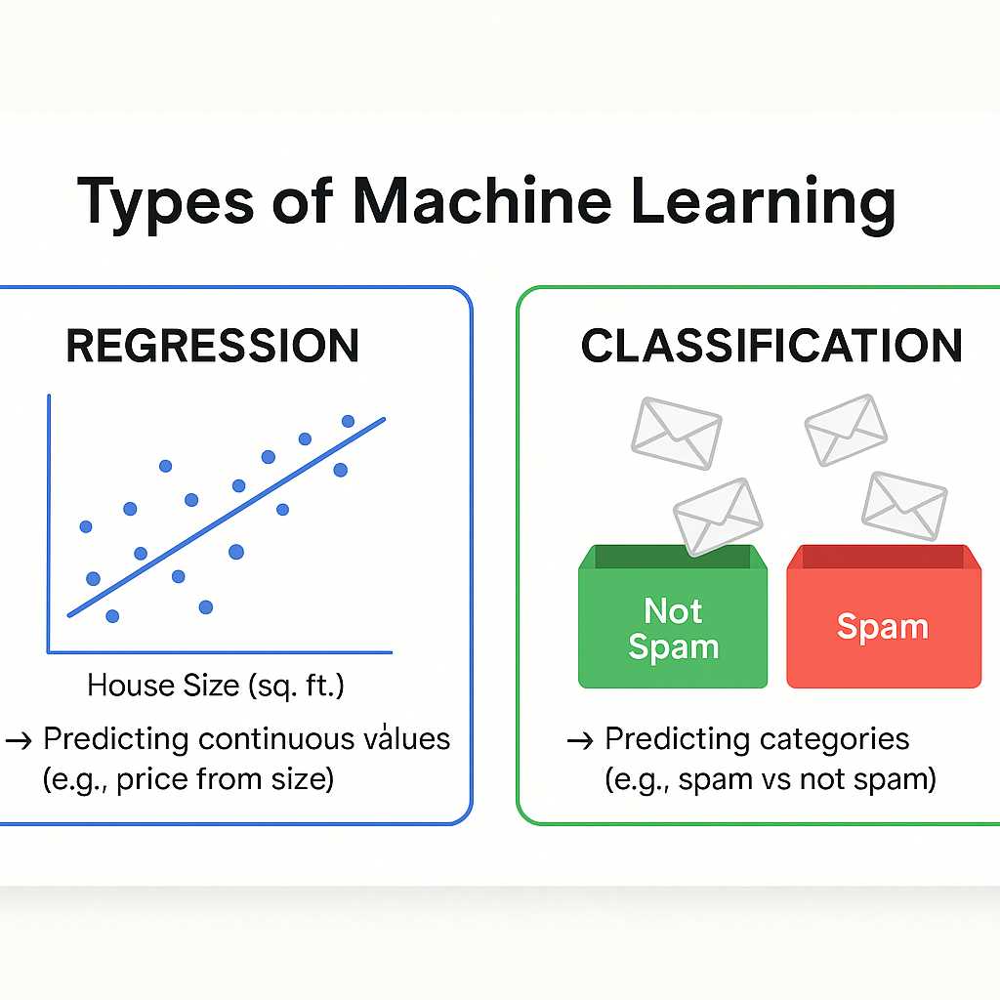
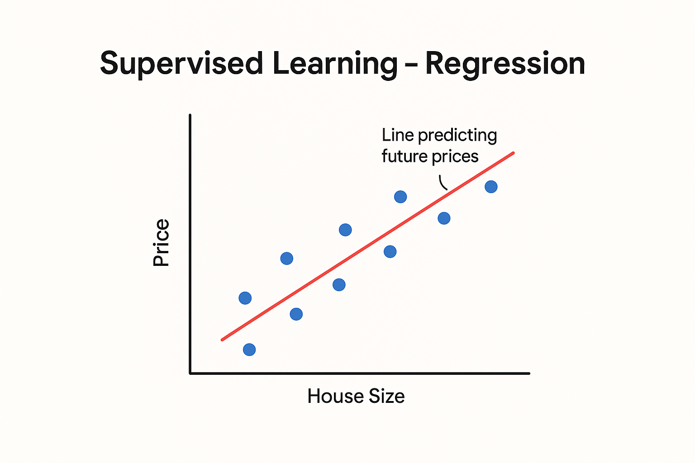
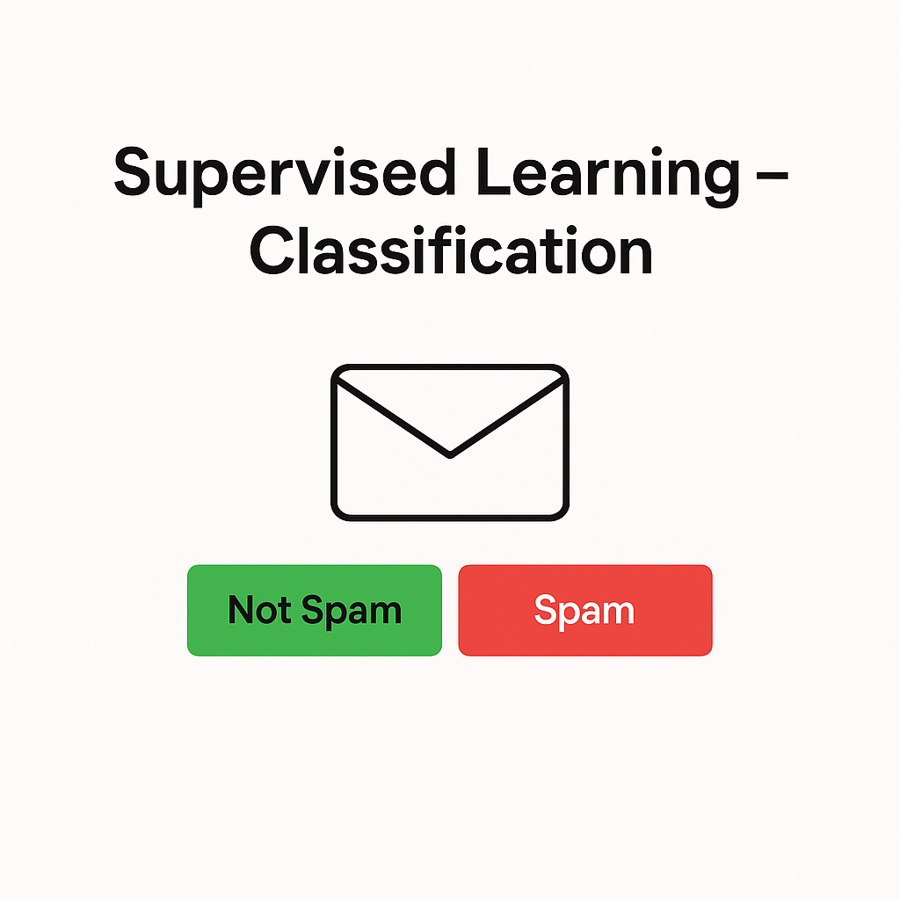
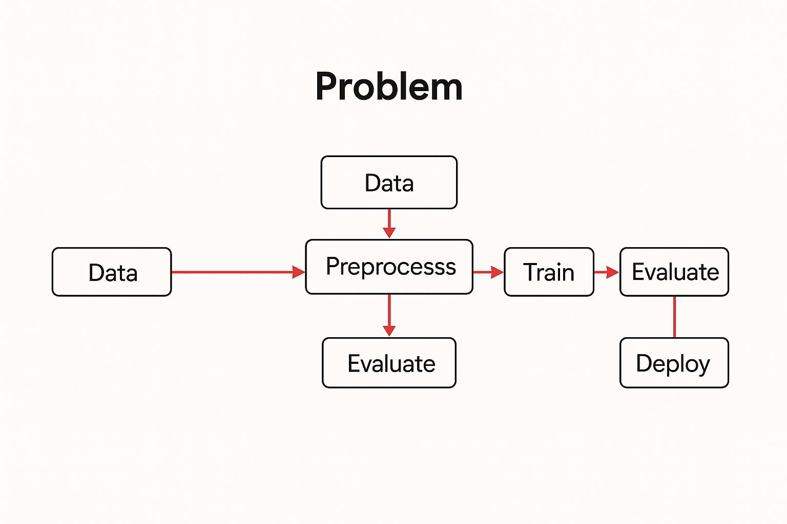
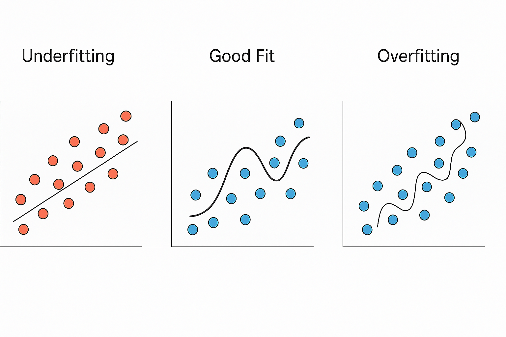

# Introduction to Machine Learning

## 🎯 Learning Objectives

By the end of this lesson, students will be able to:

1. Define what Machine Learning (ML) is.
2. Differentiate between **Supervised** and **Unsupervised** learning.
3. Understand the **ML workflow** (data → preprocessing → model → evaluation).
4. Explain **train/test split** and why it’s needed.
5. Recognize **overfitting** vs **underfitting** in models.

---

## What is Machine Learning?

### 1. Introduction

Before we dive into algorithms and math, we need to understand the big picture:
👉 **What is Machine Learning? Why do we need it?**

Machine Learning (ML) is simply about **teaching computers to learn from data**. Instead of giving the computer step-by-step instructions, we feed it **examples**, and it figures out the rules on its own.

---

### 2. Definition

**Machine Learning (ML):**

> A branch of Artificial Intelligence (AI) where computers learn patterns from data without being explicitly programmed.

Example in simple terms:

- Traditional program: You write a recipe → computer follows it.
- Machine Learning: You give the computer lots of finished cakes and ingredients → it figures out the recipe itself.

---

### 3. How ML Differs from Traditional Programming

| **Traditional Programming**                                        | **Machine Learning**                                                                    |
| ------------------------------------------------------------------ | --------------------------------------------------------------------------------------- |
| Rules are written by a human.                                      | Rules are _learned_ by the computer.                                                    |
| Input Data + Rules → Output.                                       | Input Data + Output Labels → Learned Rules (Model).                                     |
| Example: "If a message contains the word 'lottery', mark as spam." | Example: Show the system thousands of emails labeled spam/not spam, it learns patterns. |


---

### 4. Why Machine Learning?

- **Data Explosion** 📊: There’s too much data for humans to manually analyze.
- **Complex Patterns** 🔍: Some problems (like face recognition) are too complicated for explicit rules.
- **Adaptability** ⚡: ML systems can improve over time as they see more data.

---

### 5. Real-World Examples of Machine Learning

1. **Spam Filters**

   - Gmail uses ML to automatically detect unwanted emails.
   - Learns from billions of messages (words, links, patterns).

2. **Netflix & YouTube Recommendations**

   - Suggests movies/videos based on your viewing history.
   - Compares your habits with millions of other users.

3. **Self-Driving Cars**

   - ML allows cars to detect objects, pedestrians, and traffic lights.
   - Cars “learn” from millions of driving hours and sensor data.

---

### 6. Key Idea: Learning from Data

- ML works by finding **patterns** in data.
- These patterns are turned into a **model**.
- That model can then be used to make **predictions** or **decisions** on new data.

Example:

- Training: Show thousands of cat and dog pictures labeled "cat" or "dog."
- Model: Learns what makes a cat vs. dog (ears, tails, shapes).
- Prediction: When shown a new picture, it guesses "This is a cat."


---

### 7. A Tiny Python Example (optional for clarity)

```python
from sklearn.linear_model import LinearRegression
import numpy as np

# Example: Predict study hours → exam score
hours = np.array([[1], [2], [3], [4], [5]])   # input data
scores = np.array([20, 40, 60, 80, 100])      # output labels

# Train a simple ML model
model = LinearRegression()
model.fit(hours, scores)

# Predict score for 6 hours of study
print(model.predict([[6]]))  # Output: ~120
```

This simple model learns the **pattern**:
More study hours → higher score.

---

## 📘 Lesson 2: Types of Machine Learning

### 1. Introduction

Now that we know what Machine Learning is, let’s explore its main **types**.
👉 Every ML algorithm you will ever see usually falls into **one of three categories**:

1. **Supervised Learning**
2. **Unsupervised Learning**

---

### 2. Supervised Learning 🧑‍🏫

**Definition**:

- In supervised learning, the computer learns from **labeled data**.
- Think of it like a teacher giving the correct answers during training.

**Key Tasks in Supervised Learning:**

1. **Regression** → Predicting _numbers_ (continuous values).

   - Example: Predicting house prices based on size, location, and rooms.
   - Input: House features → Output: Price in dollars.

2. **Classification** → Predicting _categories_ (discrete classes).

   - Example: Spam filter.
   - Input: Email text → Output: “Spam” or “Not Spam.”



---

### 3. Unsupervised Learning 🔍

**Definition**:

- The data is **unlabeled**.
- The computer must find patterns and structure on its own.

**Key Tasks in Unsupervised Learning:**

1. **Clustering** → Grouping similar items together.

   - Example: Customer segmentation in marketing (grouping customers by behavior: frequent buyers, occasional buyers, etc.).
   - No “teacher” tells the algorithm which customer belongs where.

2. **Dimensionality Reduction** → Simplifying complex data.

   - Example: Compressing high-dimensional images into fewer features without losing important information.
   - Used in visualization, noise reduction, and speeding up algorithms.


---

### 5. Comparing the Types

| **Type**              | **Data**          | **Output**                    | **Examples**                     |
| --------------------- | ----------------- | ----------------------------- | -------------------------------- |
| Supervised Learning   | Labeled data ✅   | Predict numbers or categories | House price, Spam filter         |
| Unsupervised Learning | Unlabeled data ❌ | Find hidden patterns          | Customer groups, Market analysis |

---

Title: _Supervised Learning – Regression_

Title: _Supervised Learning – Classification_

Title: _Unsupervised Learning – Clustering_


---

### 7. Mini Python Example (for clarity)

**Supervised (Regression):**

```python
from sklearn.linear_model import LinearRegression
import numpy as np

# Study hours vs exam scores
X = np.array([[1], [2], [3], [4]])  # Hours studied
y = np.array([20, 40, 60, 80])      # Scores

model = LinearRegression()
model.fit(X, y)

print(model.predict([[5]]))  # Predict score for 5 hours study
```

**Unsupervised (Clustering):**

```python
from sklearn.cluster import KMeans
import numpy as np

# Fake customer data: [age, spending score]
X = np.array([[25, 70], [30, 90], [40, 40], [60, 20], [65, 30]])

kmeans = KMeans(n_clusters=2, random_state=0)
kmeans.fit(X)

print(kmeans.labels_)  # Shows which group each customer belongs to
```

---

## The Machine Learning Workflow

### 1. Introduction

Machine Learning isn’t just about choosing an algorithm.
👉 It’s a **workflow**: a set of stages that every project goes through.
If you skip one, your model may fail.

---

### 2. The Workflow (Step by Step)

#### **Step 1: Problem Definition**

- Ask: _What are we trying to solve?_
- Example: Predict house prices? Detect spam emails?

⚠️ Tip: Be clear whether it’s **classification**, **regression**, or another type.

---

#### **Step 2: Data Collection**

- ML needs data — the more, the better (but quality matters too).
- Sources:

  - Databases
  - Sensors (IoT)
  - Public datasets (Kaggle, UCI ML Repo)
  - User-generated data (clicks, likes, reviews)

Example: Collect 10,000 house sales with features like size, rooms, location.

---

#### **Step 3: Data Preprocessing (Cleaning)**

Raw data is messy. We prepare it:

- Handle missing values (fill or remove).
- Remove duplicates.
- Convert text/images into numerical form.
- Normalize/scale numbers.

Example: If house sizes are in m² and ft², unify them into one unit.

---

#### **Step 4: Splitting the Dataset**

- Split data into:

  - **Training set** → used to teach the model.
  - **Test set** → used to check if the model generalizes well.

- Common split: 80% train, 20% test.

---

#### **Step 5: Model Training**

- Choose an algorithm (Linear Regression, Decision Trees, Neural Networks).
- Feed training data into it.
- Model learns patterns → creates a “rule” (mathematical function).

---

#### **Step 6: Model Evaluation**

- Test the model on unseen test data.
- Use metrics like:

  - Accuracy (for classification).
  - Mean Squared Error (for regression).
  - Precision/Recall (for imbalance problems like fraud detection).

Example: If the spam filter says 95% of emails are classified correctly → accuracy = 95%.

---

#### **Step 7: Deployment**

- Once the model works well → deploy it into the real world.
- Integrated into apps, websites, or devices.
- Example: Your phone camera recognizing faces in real time.

---

#### **Step 8: Monitoring & Maintenance**

- Models degrade over time (data changes = concept drift).
- Example: Spam emails evolve with new tricks.
- Solution: retrain with fresh data regularly.

---



---

### 4. Mini Example in Python

```python
from sklearn.model_selection import train_test_split
from sklearn.linear_model import LinearRegression
import numpy as np

# Step 2: Data Collection
X = np.array([[1], [2], [3], [4], [5]])  # study hours
y = np.array([20, 40, 60, 80, 100])      # scores

# Step 4: Split dataset
X_train, X_test, y_train, y_test = train_test_split(X, y, test_size=0.2, random_state=42)

# Step 5: Train model
model = LinearRegression()
model.fit(X_train, y_train)

# Step 6: Evaluate
print("Test Score:", model.score(X_test, y_test))
```

---

## Key Machine Learning Algorithms

### 1. Introduction

After understanding the **workflow**, we now ask:
👉 _Which algorithms do we actually use to train models?_

There are hundreds, but we’ll focus on the **core family** of algorithms you must know first.

---

### 2. Supervised Learning Algorithms

#### **A. Linear Regression (for Regression Tasks)**

- **Goal:** Predict continuous numbers.
- **How it works:** Fits a straight line (or curve) through data points.
- **Example:** Predict house prices based on size.

**Tiny Example:**

```python
from sklearn.linear_model import LinearRegression
import numpy as np

X = np.array([[1], [2], [3], [4]])   # study hours
y = np.array([20, 40, 60, 80])       # scores

model = LinearRegression()
model.fit(X, y)

print(model.predict([[5]]))  # Predict score for 5 hours
```

---

#### **B. Logistic Regression (for Classification Tasks)**

- **Goal:** Predict categories (Yes/No, Spam/Not Spam).
- **Despite the name:** It’s used for _classification_, not regression.
- **How it works:** Uses a sigmoid curve to separate categories.

**Example:**

- Predict whether a student will pass (1) or fail (0) based on study hours.

---

#### **C. Decision Trees**

- **Goal:** Predict categories or numbers by asking a series of “questions.”
- **How it works:** Splits data into branches like a flowchart.
- **Example:**

  - Question 1: Is income > \$50k?
  - Question 2: Is age < 30?
  - Then → Predict “Buy product” or “Not buy.”

---

#### **D. Random Forests**

- **Goal:** Improve accuracy by combining many decision trees.
- **Idea:** “Wisdom of the crowd.” Each tree votes, and the majority wins.
- **Example:** Used in banking for fraud detection.

---

#### **E. Support Vector Machines (SVM)**

- **Goal:** Find the best boundary that separates classes.
- **How it works:** Draws a hyperplane (line in 2D, plane in 3D).
- **Example:** Classify emails as spam or not spam.

---

#### **F. Neural Networks (Deep Learning)**

- **Goal:** Mimic how the brain works (layers of neurons).
- **How it works:** Passes data through multiple layers, each learning features.
- **Example:** Used in image recognition, speech recognition, self-driving cars.

---

### 3. Unsupervised Learning Algorithms

#### **A. K-Means Clustering**

- **Goal:** Group similar data points.
- **How it works:** Places “k” centers and assigns points to nearest center.
- **Example:** Customer segmentation in marketing.

---

#### **B. Principal Component Analysis (PCA)**

- **Goal:** Reduce dimensions (features) while keeping most information.
- **Example:** Compress image data from 1000 features → 2 or 3 features for visualization.

---

### 4. Reinforcement Learning Algorithms

- **Q-Learning**: Agent learns best actions using a reward system.
- **Deep Q-Networks (DQN)**: Uses deep learning + reinforcement learning.
- **Examples:**

  - Robots learning to walk.
  - AlphaGo beating human champions in Go.

---

### 5. Algorithm Cheat Sheet (Summary Table)

| **Algorithm**        | **Type**      | **Used For**                        |
| -------------------- | ------------- | ----------------------------------- |
| Linear Regression    | Supervised    | Predict numbers (regression)        |
| Logistic Regression  | Supervised    | Classify categories                 |
| Decision Tree        | Supervised    | Simple predictions, easy to explain |
| Random Forest        | Supervised    | Ensemble for higher accuracy        |
| SVM                  | Supervised    | Best boundary for classification    |
| Neural Networks (DL) | Supervised    | Complex patterns (images, speech)   |
| K-Means              | Unsupervised  | Grouping (clustering)               |
| PCA                  | Unsupervised  | Dimensionality reduction            |
| Q-Learning / DQN     | Reinforcement | Game AI, robotics                   |

---

## Overfitting vs Underfitting

### 1. Introduction

One of the **biggest challenges** in Machine Learning is making models that generalize well.
👉 Too simple → the model misses patterns (**underfitting**).
👉 Too complex → the model memorizes instead of learning (**overfitting**).

---

### 2. What is Underfitting?

- **Definition:** Model is too simple, cannot capture the underlying structure of the data.
- **Cause:**

  - Using too few features.
  - Using a very basic algorithm (e.g., straight line for nonlinear data).

- **Result:** Both training and test accuracy are low.

**Example:**
Trying to fit a straight line to curved data → it will miss important trends.

---

### 3. What is Overfitting?

- **Definition:** Model is too complex, memorizes the training data instead of learning general rules.
- **Cause:**

  - Too many features.
  - Using a very flexible model without enough data.

- **Result:**

  - Training accuracy is very high (almost perfect).
  - Test accuracy is low (fails on unseen data).

**Example:**
Fitting a very wiggly curve through every training point, but it performs poorly on new data.

---

.


---

### 5. The Balance

- Goal in ML: **Find the sweet spot** → not too simple, not too complex.
- This is called the **Bias-Variance Tradeoff**:

  - Underfitting → High bias (too many wrong assumptions).
  - Overfitting → High variance (model is too sensitive to training data).

---

### 7. Preventing Overfitting

- Use more training data.
- Use simpler models (Occam’s Razor).
- Regularization techniques (L1, L2 penalties).
- Cross-validation to check performance.

---

## ✅ Lesson Summary

- Machine Learning = teaching computers to learn patterns from data.
- Two main types: **Supervised** (labeled data) & **Unsupervised** (unlabeled data).
- Workflow: Problem → Data → Preprocessing → Train/Test → Model → Evaluation → Deployment.
- Key challenge: balance between **underfitting** and **overfitting**.

---

## 🔚 End of Lesson 1

🎉 Congratulations! You’ve completed the **Introduction to Machine Learning** lesson.

---
